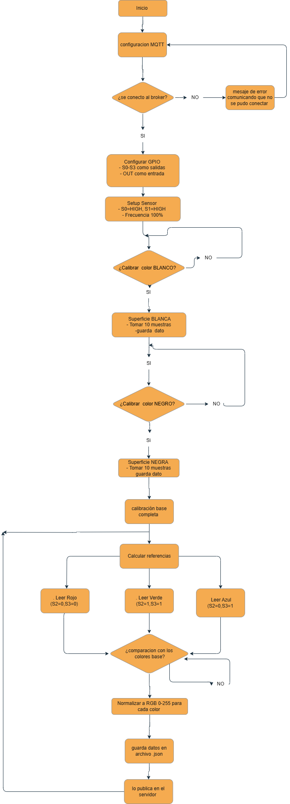
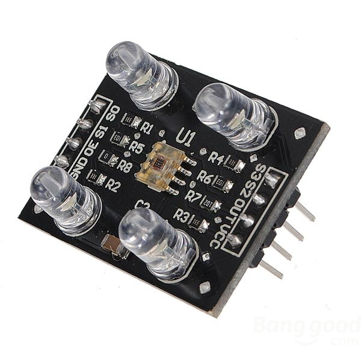
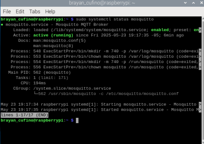
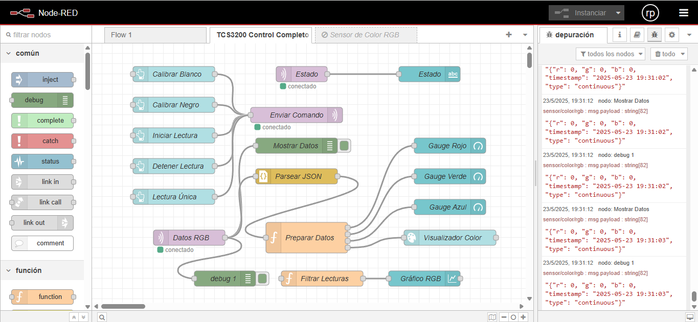
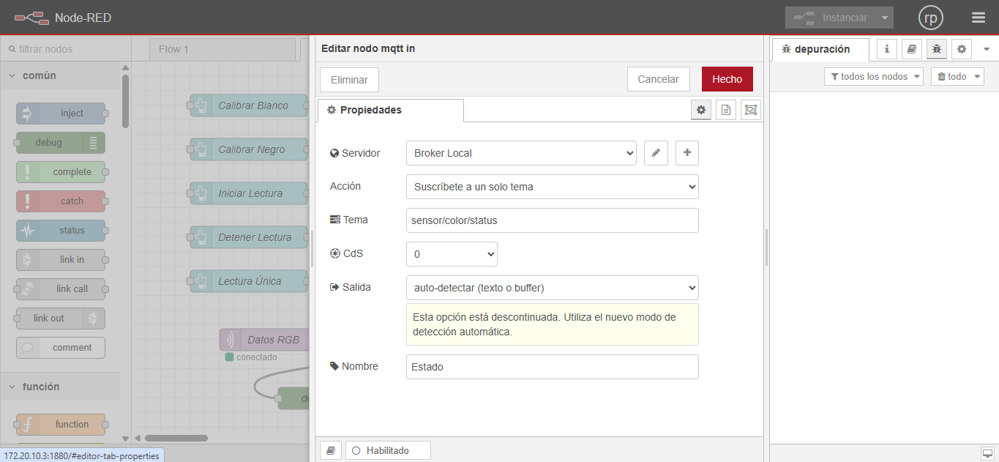
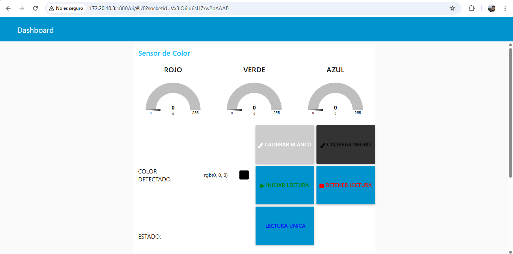
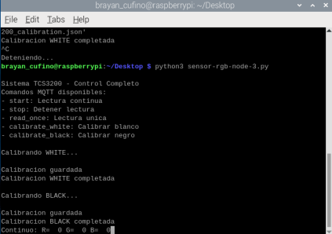

# Laboratorio conexión MQTT

## Integrantes

[Brayan Cufiño](https://github.com/BACT99)

[Ivan Castaño ](https://github.com/IFC999)

## Documentación

### Diagrama de flujo

### Sensor de color RGB en Raspberry pi zero 2w por MQTT

- Configuración de los pines GPIO: el sensor TCS3200 usa S0 y S1 para seleccionar la frecuencia de salida (aquí se configura al 100% con HIGH/HIGH), S2 y S3 para seleccionar qué filtro de color está activo (rojo, verde, azul) y OUT proporciona una señal cuadrada cuya frecuencia varía según la intensidad del color.

- Se hace la configuración del MQTT definiendo el Broker, el host, el topic para la publicación y el topic para la suscripción 

- Para leer los colores tiene 3 fases, primero selecciona el filtro (el sensor tiene matrices de fotodiodos con filtros): 

    Rojo: S2=0, S3=0

    Verde: S2=1, S3=1

    Azul: S2=0, S3=1

- Luego en la función "count_pulses" mide durante un tiempo fijo (duration), cuenta cada transición de HIGH a LOW (flanco descendente) y devuelve el conteo total (proporcional a la intensidad del color).
- Luego le asigna un tiempo al conteo de pulsos para cada color y que tome la lectura
- Despues se hace un cálculo matemático para normalizar el valor que da el sensor y mostrarlo en valores de 0 a 255 

        normalized = ((value - raw_black) / (raw_white - raw_black)) * 255

- luego se hace la comunicación con el broker

        - sensor/color/rgb: Publica valores RGB (ej: {"r":125,"g":30,"b":200})
        - sensor/color/status: Estados del sistema ("ready", "reading", "stopped")
        - sensor/color/control: Comandos de control (start/stop/calibrate)

- Inicia el bucle principal del programa el cual verifica si hay una solicitud de lectura única (prioritaria), si está en modo continuo, lee y publica constantemente los valores leídos y normalizados en un archivo .json el cual se envía por MQTT para ser leído en un flujo de NodeRed. 

### Funcionamiento de mosquitto

La pantalla de terminal muestra el resultado del comando sudo systemctl status mosquitto, el cual verifica el estado del servicio Mosquitto MQTT Broker. La salida indica que el servicio de Mosquitto está activo y ejecutándose (active (running)) desde el 23 de mayo de 2025 a las 19:17:35 -05, lo que confirma que el broker MQTT está funcionando correctamente en la Raspberry Pi.

### Node-Conectado

La imagen muestra un flujo de trabajo de Node-RED.

Este es un flujo de Node-RED que controla y visualiza datos de un sensor de color RGB TCS3200. Permite calibrar el sensor, iniciar lecturas, procesar los datos (JSON) y mostrarlos en tiempo real mediante medidores, un visualizador de color y gráficos, además de ofrecer herramientas de depuración para monitorear el flujo de información.

### Nodo MQTT

La imagen muestra la ventana de configuración de un nodo MQTT In en Node-RED.

Esta configuración permite al nodo MQTT In conectarse a un Broker Local de MQTT. Está configurado para suscribirse a un solo tema llamado sensor/color/status, lo que significa que recibirá mensajes publicados en ese tema. El "QoS" (Quality of Service) está en 0. También se observa una advertencia de que la opción de "Salida" actual está descontinuada, sugiriendo que se debería usar un nuevo modo de detección automática.

### Dashboard-Node

Es una interfaz para proyectos con sensores de color , útil para identificar o calibrar colores físicos.
Calibra el sensor usando los botones de blanco/negro.

Funcionamiento Básico

- Pulsa INICIAR LECTURA para detectar colores.

- Observa los valores RGB resultantes.

- Usa DETENER LECTURA para pausar la detección.

### Script de Python

La imagen muestra una terminal de Linux en una Raspberry Pi ejecutando un script de Python.

La terminal muestra la ejecución de un script de Python llamado sensor-rgb-node-3.py, el cual es un programa para interactuar con un sensor de color TCS3200. El script presenta una lista de comandos MQTT disponibles para controlar el sensor (iniciar/detener lecturas, lectura única, calibrar blanco/negro). La salida de la terminal muestra el proceso de calibración tanto para el color blanco como para el negro, indicando que las calibraciones fueron guardadas y completadas exitosamente. Al final, muestra  los valores continuos de R, G y B del sensor